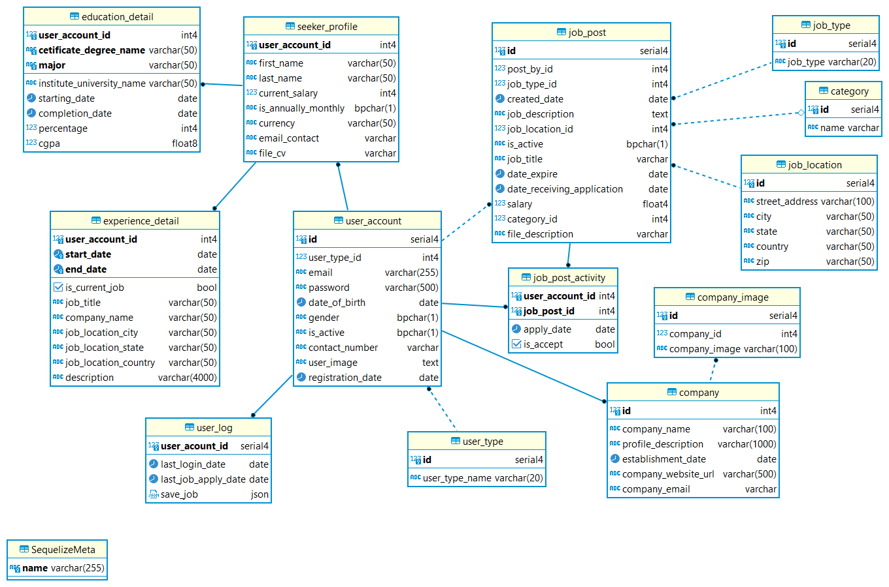

# Database

# Api
|  |  |  |  |
| ---- | ---- | ---- | ---- |
| STT | Đường dẫn | Phương thức | Mô tả |
| XÁC THỰC NGƯỜI DÙNG |  |  |  |
| 1 | /auth/login | `POST` | Đăng nhập |
| 2 | /auth/register | `POST` | Đăng ký |
| 3 | /auth/logout | `GET` | Đăng xuất |
| 4 | /auth/ | `GET` | Lấy thông tin tài khoản |
| ỨNG VIÊN |  |  |  |
| 5 | /employee/jobs` | `GET` | Lấy tất cả các công việc đang sẵn có |
| 6 | /employee/job-detail/:id | `GET` | Lấy thông tin chi tiết của một công việc |
| 7 | /employee/apply | `GET` | Lấy danh sách các công việc đã ứng tuyển |
| 8 | /employee/apply | `POST` | Ứng tuyển một công việc |
| 9 | /employee/profile | `GET` | Lấy thông tin hồ sơ cá nhân |
| 10 | /employee/profile/general | `PATCH` | Cập nhật thông tin chung của hồ sơ cá nhân |
| 11 | /employee/profile/education | `PATCH` | Cập nhật thông tin học vấn |
| 12 | /employee/profile/experience | `PATCH` | Cập nhật kinh nghiệm |
| 13 | /employee/profile/education | `POST` | Tạo một học vấn mới |
| 14 | /employee/profile/experience | `POST` | Tạo thông tin kinh nghiệm mới |
| 15 | /employee/profile/education | `DELETE` | Xóa một mục học vấn |
| 16 | /employee/profile/experience | `DELETE` | Xóa một mục kinh nghiệm |
| NHÀ TUYỂN DỤNG |  |  |  |
| 17 | /employer/profile | `GET` | Lấy thông tin hồ sơ của nhà tuyển dụng |
| 18 | /employer/profile | `POST` | Tạo hoặc cập nhật thông tin hồ sơ của nhà tuyển dụng |
| 19 | /employer/job | `GET` | Lấy tất cả các công việc đã đăng của tài khoản |
| 20 | /employer/job | `POST` | Tạo một công việc mới |
| 21 | /employer/job/:id_job | `DELETE` | Xóa một công việc |
| 22 | /employer/job/file_description/:id_job | `POST` | Tải lên tệp mô tả cho một công việc |
| 23 | /employer/job-apply/:id | `GET` | Lấy danh sách ứng tuyển của một công việc |
| 24 | /employer/job-apply/:id | `POST` | Chấp nhận một ứng viên |
| 25 | /employer/seeker-profile/:id | `GET` | Lấy thông tin hồ sơ của một ứng viên |